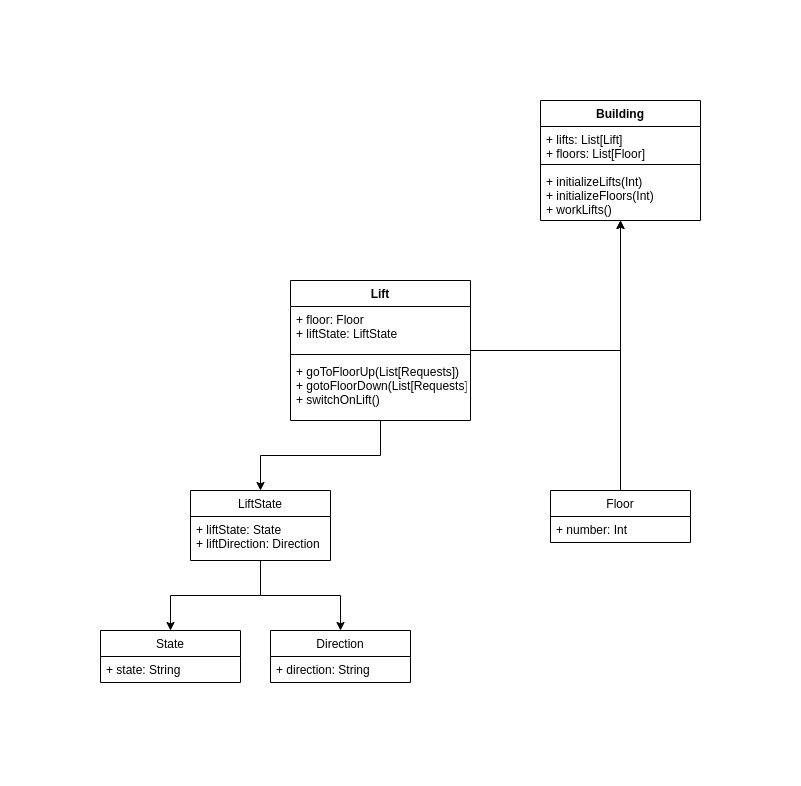

## Lift Management System

This is a scala developed project that can handle no of lifts inside a building

### Requirements

- Intellij
- scala 2.12.10
- sbt 1.3.4

### class diagram

simple class diagrams attached



### Working

#### Main classes

- Lift: This class gives the required functionality for the lift object. any number of lifts can be created.
- Building - This class is mainly used to hold the no of lifts and process the incoming requests
- ShowStatus - This class is used to print the status of the lifts


TODOS:
1. efficient lift choosing for optimal time
2. cover all test cases for the classes
3. Exceptions and Loggers need to be added

### How to Run

- It can be directly imported to intellij and Simulate Object can run.

- build the project as jar using the following command:

```shell
sbt assembly
```

take the jar and run the Simulate Object

```shell
scala <jar name>
java -jar <jar name>
```

### sample output

```shell
Connected to the target VM, address: '127.0.0.1:47251', transport: 'socket'
No of Lifts: 2
No of Floors: 10
0 9
4 6
3 0 
Lift 1 ---- > 0(OPEN)Lift 2 ---- > 0(CLOSE)
Lift 1 ---- > 0(CLOSE)Lift 2 ---- > 0(CLOSE)
Lift 1 ---- > 0(CLOSE)Lift 2 ---- > 0(CLOSE)
Lift 1 ---- > 1(CLOSE)Lift 2 ---- > 1(CLOSE)
Lift 1 ---- > 2(CLOSE)Lift 2 ---- > 2(CLOSE)
Lift 1 ---- > 3(CLOSE)Lift 2 ---- > 3(OPEN)
Lift 1 ---- > 4(OPEN)Lift 2 ---- > 3(CLOSE)
Lift 1 ---- > 4(CLOSE)Lift 2 ---- > 3(CLOSE)
Lift 1 ---- > 5(CLOSE)Lift 2 ---- > 2(CLOSE)
Lift 1 ---- > 6(OPEN)Lift 2 ---- > 1(CLOSE)
Lift 1 ---- > 6(OPEN)Lift 2 ---- > 0(OPEN)
Lift 2: 8 seconds
Lift 1 ---- > 6(CLOSE)Lift 2 ---- > 0(CLOSE)
Lift 1 ---- > 7(CLOSE)Lift 2 ---- > 0(CLOSE)
Lift 1 ---- > 8(CLOSE)Lift 2 ---- > 0(CLOSE)
Lift 1 ---- > 9(OPEN)Lift 2 ---- > 0(CLOSE)
Lift 1: 11 seconds
```